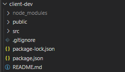

# Basic CMS

## Front-end using ReactJS

### Basic
1. Install react using npx 

``` console
    npx creat-react-app name-of-your-app
```
-in my case I have installed my app in the root folder of my CMS project and I have named it: client-dev

2. If react was succcesfully installed you will see something like this in your console:


3. Now let's navigate into the client-dev and type in the console
``` console
    npm start
```
- To see the result, simply type in your browser http://localhost:3000, if you are runnin this remotely then you will have to put the ip address you want to reach, for example: http://88.200.63.148:3000. 

- So far we have to diffetent address: one for the server in the port 5000 and the second one in the client in the port 3000. We will keep this like thtat for now. At the end fo the projects things will be a littel bit different.

- The structure of the folder must be something like this:


- We are interested in the folder that is named *src*, because there is where the logic of the *front-end* will happen.

4. In Visual Code open the file *App.js* and delete all the content.
- This is because we won't use *hooks* for this project, instead we will implement OOP.
- Try to save and you will see in your browser that React returns an error.

5. In line number one write the name of the dependencies we need
``` javascript 
    import React from
```
6. Then create an empty class App that extends from React.Component
``` javascript 
    class App extends React.Component{}
```
- Remeber to check the documentation every time you can to know about the methods and life cycle of the component :)

7. In the body of the class let's call the render method. 
``` javascript 
    class App extends React.Component
    {
        render()
        {
            ///Here we should put what  we wan to display in the browser, for example
            return "Hola mundo!!"
        }
    }
```
- if you save, we still will  have an error inthe browser since we haven't export our class object yet.
8. Export your class at the end of the code
``` javascript 
export default App
```
- After saving, you will see how the browser displays our string.
-  Let's make somthing more fancy by introducing a new concept: JSX <https://reactjs.org/docs/introducing-jsx.html>. 

### Visuals
1. Instead of returning an string, let's implement the following. 
``` javascript 
return (
  // Main container
  <div>
    {/* Menu container */}
    <div>
        <ul>
            <li><a  href="#">Home</a></li>
            <li><a href="#">About</a></li>
            <li><a href="#">Novice</a></li>
            <li><a href="#">Create news</a></li>
            <li><a href="#">Register user</a></li>
            <li><a href="#">Login</a></li>

        </ul>
    </div>
    {/* Viewer */}
    <div>
      Something different here per button
    </div>
  </div>
)
```
- Save and visualize the outcome (sometime you need to reaload the webpage to see the result)
- The structure of our simple CMS is there, but looks, let say... not nice. Let's try to improve it a little bit using pure *css*
2. Import App.css to your App.js script (You can always create your own style sheet, but in this case we already have one css document there)
``` javascript
import './App.css'
```
3. Delete everything inside App.css file as we want to use our "own" styles.

4. Copy and paste the following code in App.js
``` CSS
ul {
  list-style-type: none;
  margin: 0;
  padding: 0;
  overflow: hidden;
  background-color: #333;
}

li {
  float: left;
  border-right:1px solid #bbb;
}

li:last-child {
  border-right: none;
}

li a {
  display: block;
  color: white;
  text-align: center;
  padding: 14px 16px;
  text-decoration: none;
}

li a:hover:not(.active) {
  background-color: #111;
}

.active {
  background-color: #0f5ef2;
} 
```
- Basically this piece of code is setting up attributes to all *ul* ans *li* elements in the DOM, so if you create a new *ul* list anywhere in the document, the properties and attributes are gonna be the same for all of them. To solve this potential issue you will need to use classes and identifiers. You can learn more about styling in <https://www.w3schools.com/css/>
-Pure css is suitable when you work with small projects but for bigger projects user fraworks like, boostraps, tailwind, material-ui, etc. 
5. In-line style, html attributes, among others follwo another syntax in JSX. To see an example let's modify the last *li* element of our  navigator list.
- In regular *HTML* we will do something like this 
``` HTML
    <li style="float:right"><a href="#about">Login</a></li>
```
- But in JSX needs to be like this
``` JSX
    <li style={{float:"right"}}><a href="#">Login</a><li>
```
- For now to finish with the visualization of our app, let's preapre the *viewer* of our app to hold the information that will be displayed.
6. In App.js assing an identifier to the div, let's name it "viewer"
``` JSX
    <div id="viewer">
        Something different here per button
    </div>
```
7. In App.css create a new rule for the viewer.

``` CSS
    #viewer{
    width: 100%;
    background-color: greenyellow;
    }
```
- The next step is to add some logic to our app in order to deal with the user interactios.

### User interactions

1. Create the constructor of our component

``` javascript
class App extends React.Component
{
    constructor(props)
    {
      super(props);  
    }
```
2. Under super create an object calle state, this will hold the status/variables of our app. 

``` javascript
class App extends React.Component
{
    constructor(props)
    {
      super(props);  
      this.state={}
```
- What is the constructor for? <https://reactjs.org/docs/react-component.html#constructor>

3. Create a variable inside *this.state* object and name it CurrentColor and give the defaul value *"white"*
``` javascript
 constructor(props)
 {
   super(props);
   //state is where our "global" variable will be store
   this.state={
     CurrentColor:"white"
   }
 } 
```

- In my case I'll name any variable that is store in the local state using this pattern: MyVariable and any custom method as QCustomMethod. 

4. Create a method *QChangeViewerBG*, just before *render* method that recieves one parameter *index*. Inside creaate and array with 6 colors (you can use hex, rgb or name values) but the array must contain string values. 
``` javascript
QChangeViewerBG=(index)=>
{
 const SeccionsBG=["white","gray","blue","green","orange","yellow"] 
} 
```
- Note that you can use the old notation *QChangeViewerBG(){}* to define your methods but to differentiate from in-built methods from React I'll use the fat arrow notation.
5. React has a method to update the local state object, we wil use it to modify the default value of CurrentColor when user clicks on any of our buttons
``` javascript
QChangeViewerBG=(index)=>
{
 const SeccionsBG=["white","gray","blue","green","orange","yellow"] 
  this.setState({
    CurrentColor:SeccionsBG[index]
  })
} 
```
6. Modify you *li* elements in you list in such way that on clic the function is called and per every button (<a> element) a different index is passed to the function.
``` javascript 
    <li>
    <a class="active" 
        href="#"
        onClick={()=>this.QChangeViewerBG(0)}>Home</a>
    </li>
```
- Remeber that *on click* from *HTML* is invoked *onCLick* in JSX
- Every time the users clicks on the element a function that returnt the QChangeViewerBG is called, this need to be different per each element since the suppose to pass diferent values.
7. In *render* method, just before *return* define a variable name *color* that is gonna hold the value in the CurrentColor variable from the local state.
``` javascript 
    render()
    {
    //Accesing the state value of a variable
    var color= this.state.CurrentColor
    return (
```
8. Finally, modify the *div* with identifier *viewer* by adding an in-line style attribute.
 ``` JSX 
    <div id="viewer" style={{backgroundColor:`${color}`}}>
```